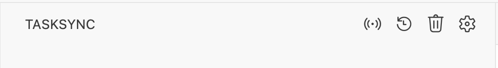
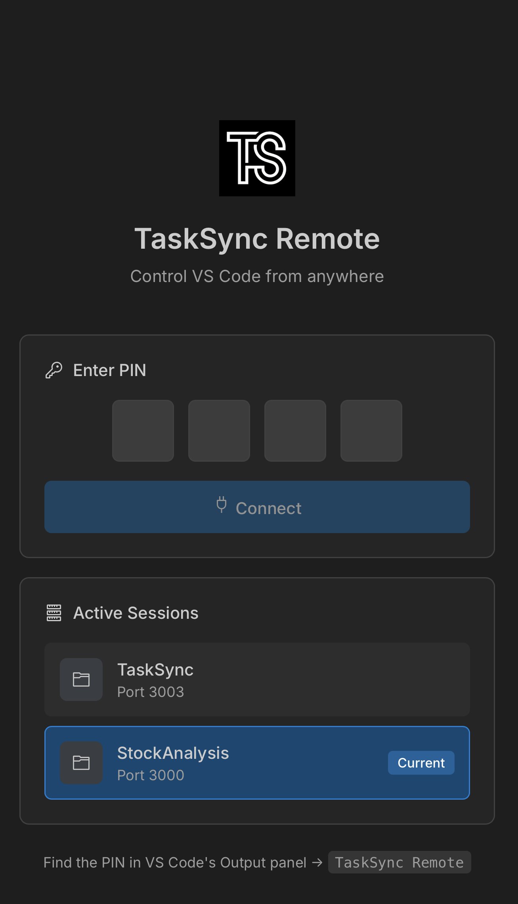
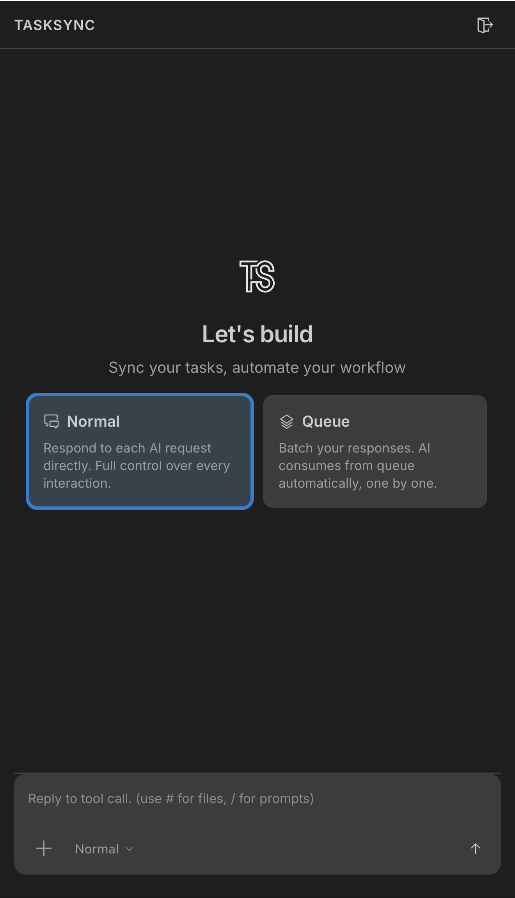

# TaskSync Remote Access

Control your VS Code AI coding sessions from your phone or any browser. No more being tied to your desk while AI works on your code!

## Overview

TaskSync Remote Access lets you:
- **Monitor AI tool calls** from your mobile device
- **Approve or respond** to AI requests on the go
- **Queue prompts** for batch processing
- **Switch between workspaces** seamlessly


*Landing page with PIN authentication and active sessions*

## Quick Start

### 1. Start the Remote Server

Click the **broadcast icon** (📡) in the TaskSync panel title bar.



Or use the command palette:
- `Cmd/Ctrl + Shift + P` → "TaskSync: Toggle Remote Server"

### 2. Get Your Connection Info

When the server starts, you'll see:
- **Local URL**: `http://localhost:3000`
- **Network URL**: `http://192.168.x.x:3000` (for mobile access)
- **4-digit PIN**: Required for authentication


### 3. Connect from Your Phone

1. Open the **Network URL** on your phone's browser
2. Enter the **4-digit PIN** shown in VS Code
3. Tap **Connect**



### 4. Start Using TaskSync Remotely

You'll see the same UI as VS Code, fully functional:


*TaskSync running on mobile with full functionality*

## Features

### 🔐 PIN Authentication
Each session generates a unique 4-digit PIN. This ensures only you can access your VS Code instance.

### 📱 Multiple Active Sessions
Running VS Code on multiple projects? The landing page shows all active TaskSync sessions. Just tap to switch!

### ⚡ Real-time Sync
All interactions sync instantly between VS Code and your mobile device:
- Tool call notifications
- Queue updates
- Response submissions

### 🌐 Works on WiFi
Access from any device on the same network. Perfect for:
- Working from your couch
- Monitoring long-running AI tasks
- Quick approvals while away from your desk

### 📲 PWA Support
Add TaskSync to your home screen for an app-like experience:
1. Open the URL in Safari/Chrome
2. Tap "Add to Home Screen"
3. Launch like a native app!

## Commands

| Command | Description |
|---------|-------------|
| `TaskSync: Toggle Remote Server` | Start/stop the remote server (title bar button) |
| `TaskSync: Start Remote Server` | Start the remote server |
| `TaskSync: Stop Remote Server` | Stop the remote server |
| `TaskSync: Show Remote URL` | Display connection URLs and PIN |

## Settings

| Setting | Default | Description |
|---------|---------|-------------|
| `tasksync.remoteEnabled` | `false` | Auto-start remote server on extension activation |
| `tasksync.remotePort` | `3000` | Preferred port for the remote server |

## How Active Sessions Work

When you start a Remote Server, TaskSync registers the session with:
- **Workspace name** (your project folder name)
- **Port number**
- **Session PIN**
- **Start time**

This information is stored in VS Code's global state, allowing the landing page to show all your active TaskSync instances across different projects.

## Security Considerations

- **PIN Authentication**: 4-digit PIN required for all connections
- **Local Network Only**: Server binds to your local network (not exposed to internet)
- **Session Isolation**: Each workspace has its own PIN and session
- **No Data Storage**: The web UI doesn't store any of your code or data

## Troubleshooting

### Can't connect from mobile?
- Ensure your phone is on the same WiFi network
- Check if a firewall is blocking the port
- Try a different port in settings

### Server won't start?
- Port might be in use. Change `tasksync.remotePort` in settings
- Check the Output panel (TaskSync Remote) for errors

### PIN not working?
- PINs are regenerated each time the server starts
- Check the Output panel for the current PIN
- Make sure you're connecting to the right session

## Architecture

```
┌─────────────────┐     WebSocket      ┌──────────────────┐
│   VS Code       │◄──────────────────►│   Phone/Browser  │
│   Extension     │                    │   (Web UI)       │
├─────────────────┤                    ├──────────────────┤
│ WebviewProvider │     Socket.io      │   Same UI code   │
│ RemoteUiServer  │◄──────────────────►│   via REST + WS  │
└─────────────────┘                    └──────────────────┘
```

The Remote UI Server:
1. Serves the same HTML/CSS/JS as the VS Code webview
2. Uses Socket.io for real-time bidirectional communication
3. Bridges messages between web clients and the extension

---

**Enjoy coding from anywhere!** 🚀
